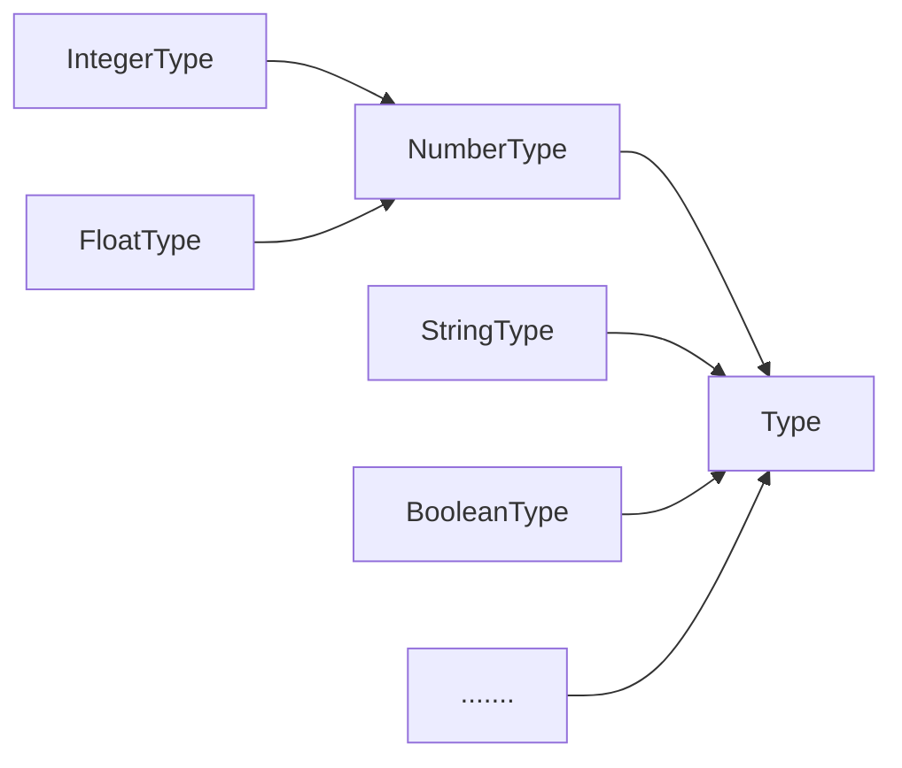

# CustomFactory [](http://travis-ci.org/snowyu/custom-factory.js) [](https://npmjs.org/package/custom-factory) [](https://npmjs.org/package/custom-factory) [](https://npmjs.org/package/custom-factory)

Easily add the factory ability to your class or object which can be singleton, name, register/unregister and aliases your class/object items.

The factory could be hierarchical or flat. defaults to hierarchical.
The flat factory means register only on the Root Factory.

The General Factory for class or object(singleton instance).

Hierarchical factory(`CustomFactory`):

1. all registered items are stored into the root factory and parent factory.
1. the registered items are the enumerable properties of the root factory class and parent factory class.
   * unless registered names or aliases exists.

The class factory pattern is a design pattern that allows for the registration and retrieval of classes based on a unique name or alias. The main goal of the pattern is to decouple the creation of objects from their use, thus promoting better code reusability and flexibility.

The `BaseFactory` class is a simple implementation of the class factory pattern that supports flat registration and retrieval of classes. The `register()` method allows a class to be registered with the factory by providing a constructor function, along with an optional set of options. The options can include a unique name or alias for the class, as well as a display name. Multiple aliases can also be provided. The `unregister()` method removes a class from the factory, and the `get()` method retrieves a class based on its unique name or alias.

The `CustomFactory` class is an extension of `BaseFactory` that supports hierarchical registration of classes. Classes can be registered with parent classes, creating a hierarchy of class registration that resembles a directory structure. The `register()` method can take an optional parent class parameter, allowing a class to be registered as a child of the parent. The `path()` method returns a string representation of the hierarchical path to a class, and the `pathArray()` method returns an array representation of the hierarchical path.

Overall, the class factory pattern provides a useful way to manage classes in a flexible and organized manner, especially in large-scale software systems.

## Usage

* BaseFactory: the flat factory
  * CustomFactory: the hierarchical factory

## Factory Development

### The Flat Factory

The `BaseFactory` class is used for the simplest form of factory pattern, without any hierarchical registration functionality. It provides the following static methods:

* `register(ctor, options)`: Registers a class to the factory. The `ctor` parameter is the constructor function of the class to be registered, and the `options` parameter is an object that can contain the following properties:
  * `name`: The unique ID name to register the class. If not provided, the class name will be used.
  * `displayName`: The display name for the class.
  * `alias` or `aliases`: The alias or aliases for the class.
  * `baseNameOnly`: The maximum level to extract the basename from the class name to register it. The default is 1, which means the first part of the class name will be used as the registered name.
* `unregister(aName|aClass|undefined)`: Unregisters a class, class name, or itself from the factory.
* `setAliases(aClass, ...aliases: string[])`: Adds or updates aliases for a class.
* `forEach(cb: (class: typeof BaseFactory, name: string)=>'brk'|string|undefined)`: Executes a provided callback function once for each registered element.
* `get(name: string): typeof BaseFactory`: Gets the registered class via name.
* `formatName(aName: string): string`: Formats the registered name. By default, it returns the same as `aName`. This method can be overridden to implement case-insensitive matching.

The `BaseFactory` class also has the following instance method:

* `initialize()`: An initialization method that can be called by the constructor. It passes through all arguments coming from the constructor.


```js
import { BaseFactory } from 'custom-factory'

class Factory extends BaseFactory {
  initialize(aOptions) {
    if (typeof aOptions === 'number') {
      this.bufferSize = aOptions
    } else if (aOptions && aOptions.bufferSize) {
      this.bufferSize = aOptions.bufferSize
    }
  }
}

const register = Factory.register.bind(Factory)
const aliases = Factory.setAliases.bind(Factory)
const unregister = Factory.unregister.bind(Factory)

class MyFactory {}
register(MyFactory)
aliases(MyFactory, 'my', 'MY')

expect(Factory.get('my')).toStrictEqual(MyFactory)
Factory.setDisplayName('MyFactory', 'ChangeIt')
expect(Factory.getDisplayName('MyFactory')).toStrictEqual('ChangeIt')
expect(MyFactory.getDisplayName()).toStrictEqual('ChangeIt')

let result = Factory.createObject('my', 32)
expect(result).toBeInstanceOf(MyFactory)
expect(result).toBeInstanceOf(Factory)
expect(result).toHaveProperty('bufferSize', 32)

```

### The Hierarchical Factory

HierarchicalFactory is a subclass of BaseFactory and provides hierarchical registration functionality. Its core method is `register`, which allows registering a class to its parent class. The parent-child relationship creates a hierarchical structure that resembles a directory tree. The `register` method can also take an optional `aOptions` parameter that specifies additional options for the registered class and factory, such as a unique name, a display name, and a level of name extraction from the class name.

The HierarchicalFactory class also provides two additional static methods, `path` and `pathArray`, that allow getting the hierarchical path of a registered class. The `path` method returns a string that represents the hierarchical path of the class, starting from the root factory down to the registered class. The `pathArray` method returns an array of factory items that represent each level of the hierarchical path, starting from the root factory down to the registered class.

Overall, HierarchicalFactory provides a powerful tool for creating and managing hierarchical class structures in a flexible and extensible way.


HierarchicalFactory: The HierarchicalFactory class extends BaseFactory and adds hierarchical registration functionality. It provides the following static methods:

* `register(aClass, aParentClass, aOptions)`: Registers a class to a parent class.
* `register(aClass, aOptions)`: Registers a class to itself or to the parent class specified in the `aOptions` object.
* `path(aClass?: typeof CustomFactory, aRootName?: string)`: Gets the path string of a HierarchicalFactory item or itself.
  * The `aClass` parameter is the class to get the path string for. If not provided, the path string of the current instance will be returned.
  * The `aRootName` parameter is the name of the root factory. If not provided, it defaults to `RootFactory.ROOT_NAME || RootFactory.prototype.name || RootFactory.name`.
* `pathArray(aClass?: typeof CustomFactory, aRootName?: string)`: Gets the path array of a HierarchicalFactory item or itself.
  * The `aClass` parameter is the class to get the path array for. If not provided, the path array of the current instance will be returned.
  * The `aRootName` parameter is the name of the root factory. If not provided, it defaults to `RootFactory.ROOT_NAME || RootFactory.prototype.name || RootFactory.name`.

The `register` method in HierarchicalFactory has the same signature as in BaseFactory, but it registers the class to a parent class. This allows for hierarchical registration and lookup of classes.

The `path` and `pathArray` methods are used to get the path of a HierarchicalFactory item or itself. The path is a string or an array of strings that represents the hierarchical structure of the registered classes. The `aRootName` parameter is used to specify the name of the root factory, which is the top-level


factory in the hierarchy. By default, it is set to `RootFactory.ROOT_NAME || RootFactory.prototype.name || RootFactory.name`.

For example, let's say we have registered the following classes in a HierarchicalFactory:


```
RootFactory
├─ Codec
│  ├─ TextCodec
│  └─ ImageCodec
├─ Serializer
│  ├─ JsonSerializer
│  └─ XmlSerializer
└─ Validator
   ├─ RequiredValidator
   └─ LengthValidator
```

To get the path of `TextCodec`, we can call `HierarchicalFactory.path(TextCodec)` which will return `"Codec.TextCodec"`. To get the path array of `TextCodec`, we can call `HierarchicalFactory.pathArray(TextCodec)` which will return `["Codec", "TextCodec"]`. If we want to use a different root factory name, we can specify it as the second parameter, for example, `HierarchicalFactory.path(TextCodec, "MyRootFactory")` which will return `"MyRootFactory.Codec.TextCodec"`.




The realistic dynamic type example

```js
import { CustomFactory, BaseFactory } from 'custom-factory'

export class Type extends CustomFactory {

  static toValue(aValue, options) {return aValue}
  static validate(aValue, raiseError, aOptions) {}
  static createType(options) {
    const vTypeClass = createCtor(options.name)
    if (register(vTypeClass, this, options)) {
      // assign type properties from options
      assignProperties(vTypeClass, options)
      return vTypeClass
    }
  }

  initialize(value, options) {
    this.assign(value, options)
  }

  assign(value, options) {this.value = this.constructor.toValue(value, options)}
  isValid(options) {return this.constructor.validate(this.value, false, options) }
  valueOf() {return this.value}
  toJSON() {return this.toObject()}

  toString() {return this.value+''}
  toObject(options) {return this.value}
}

export const register = Type.register.bind(Type)
export const unregister = Type.unregister.bind(Type)
export const alias = Type.setAliases.bind(Type)

export class IntegerType extends Type {
  static toValue(aValue, options) {
    let result
    const vTypeOf = typeof aValue
    if (vTypeOf === 'string') {
      result = parseInt(aValue)
    } else if (vTypeOf === 'number') {
      result = Math.round(aValue)
    }
    return result
  }
}
register(IntegerType)
aliases(IntegerType, 'int')
```

### Factory Usage

The Simplest Class Factory.

```js
const IntegerType = TypeFactory.get('Integer')
// it can use an alias to visit.
const IntType = TypeFactory.get('Int')

// Int1Type is the same with IntType
IntType.should.be.equal(IntegerType)

var i = new IntType(1)
```

The hierarchical singleton object factory.

```js
const TextCodec = Codec.get('Text')     // # get the JsonCodec Class
const JsonCodec = Codec.get('Json')     // # note: name is case-sensitive!
const Json1Codec = TextCodec.get('Json') // # or like this

const TextCodec = Codec.get('Text')  // or Codec('utf8')

JsonCodec.should.be.equal(Json1Codec)

const NumberType   = Type.get('number')
const IntegerType  = Type.get('integer')

isInheritedFrom(IntegerType, NumberType).should.be.true
IntegerType.should.be.equal(NumberType.get('integer'))

const aInteger = new IntegerType(124)
const aRangeInteger = new IntegerType(0, {min: 0, max: 100})

expect(aInteger).toBeGreaterThan(aRangeInteger)
aRangeInteger.assign(6)
expect(aInteger + aRangeInteger).toEqual(130)

```

Overall, the BaseFactory and HierarchicalFactory provide a flexible and convenient way to manage and create instances of registered classes. The ability to register, unregister, and get classes by name or alias, as well as the hierarchical structure provided by the HierarchicalFactory, make it easy to organize and access different classes in a project.

## API

The registered class is put into the property(the specified registered name) of the parent class.

* BaseFactory: the flat factory
  * static members:
    * `register(ctor, options)`: register a class to the factory,
      * `ctor`: it will be automatically inherited to the Factory after registered if ctor isn't derived from BaseFactory
      * `options` *`(object|string)`*: the options for the class and the factory
        * it is the registered name if aOptions is string.
        * `name` *`(String)`*: optional unique id name to register, defaults to class name
        * `displayName`: optional display name
        * `alias`,`aliases` *`(String|string[])`*: optional alias
        * `baseNameOnly` *`(boolean)`*: extracts a specified number of words from a PascalCase class name to use as a base name for registration, only if no `name` is specified.
          * defaults to true. the baseNameOnly number can be used on hierarchical factory.
          * false means use the whole class name to register it, no extract.
          * eg, the `Codec` is a Root Factory, we add the `TextCodec` to "Codec"
            * `baseNameOnly = true`: `TextCodec` name is 'Text'
            * `baseNameOnly = false`: `TextCodec` name is 'TextCodec'
        * `isFactory` `{Function|boolean}`：Whether is the factory item，defaults to `true`
        * `autoInherits` `{boolean}`: enable to inherits automatically if registered item is factory item, defaults to `true`
    * `unregister(aName|aClass|undefined)`: unregister the class, class name or itself from the Factory
    * `setAliases(aClass, ...aliases: string[])`: add/update aliases to the aClass.
    * `setAlias(aClass, alias: string)`: add/update an alias to the aClass.
    * `getAliases(aClass: typeof BaseFactory|string|undefined)`: get the aliases of the class or itself
    * `removeAlias(...aliases: string[])`: remove aliases from the factory.
    * `cleanAliases(aClass: typeof BaseFactory|string|undefined)`: remove all aliases of the registered item or itself
    * `aliases: string[]`: get or set the aliases of itself.
      * Note: assign the value will clean all aliases of itself first.
    * `getDisplayName(aClass: typeof BaseFactory|string|undefined)`: get the display of the class or itself
    * `setDisplayName(aClass?: typeof BaseFactory|string|undefined, displayName: string|{displayName: string})`: set the display of the class or itself
    * `forEach(cb: (class: typeof BaseFactory, name: string)=>'brk'|string|undefined)`: executes a provided callback function once for each registered element.
    * `get(name: string): typeof BaseFactory`: get the registered class via name
    * `registeredClass(aName: string|undefined): false|typeof BaseFactory`: check the name, alias or itself whether registered
    * `formatName(aName: string): string`: format the registered name, defaults to same as aName. you can override this method to implement case insensitive.
    * `findRootFactory(): typeof BaseFactory`: optional override, if you have your abstract factory
    * `_Factory`: internal property, The Root Factory class
    * `_children`: internal property, The registered Factory classes
    * `_aliases`: internal property, The registered Factory aliases
  * instance members
    * `initialize()`: initialize instance method which called by `constructor()`
      * pass through all arguments coming from constructor
* CustomFactory: the hierarchical factory inherits from BaseFactory(Only the different and new methods are listed here)
  * static members
    * `register(aClass, aParentClass, aOptions)`: register the aClass to aParentClass Class.
    * `register(aClass, aOptions)`: register the aClass to itself or `aOptions.parent`
      * `options`*(object|string)*: the options for the class and the factory
        * it is the registered name if aOptions is string.
        * `name`*(String)*: optional unique id name to register, defaults to class name
        * `displayName`: optional display name
        * baseNameOnly*(number)*: extracts a specified number of words from a PascalCase class name to use as a base name for registration, only if no `name` is specified. The parameter value indicates the maximum depth of the word extraction.
          * defaults to 1. the baseNameOnly number can be used on hierarchical factory.
          * 0 means use the whole class name to register it, no extract.
          * eg, the `Codec` is a Root Factory, we add the `TextCodec` to "Codec", add the `JsonTextCodec` to "TextCodec"
            * baseNameOnly = 1: `TextCodec` name is 'Text', `JsonTextCodec` name is 'JsonText'
            * baseNameOnly = 2: `TextCodec` name is 'Text', `JsonTextCodec` name is 'Json'
    * `path(aClass?: typeof CustomFactory, aRootName?: string)`: get the path string of this aClass factory item or itself.
      * `aRootName`: defaults to `RootFactory.ROOT_NAME || RootFactory.prototype.name || RootFactory.name`
    * `pathArray(aClass?: typeof CustomFactory, aRootName?: string)`: get the path array of this aClass factory item or itself.
      * `aRootName`: defaults to `RootFactory.ROOT_NAME || RootFactory.prototype.name || RootFactory.name`

**Note**: the `name` is **case sensitive**, you can overwrite the `formatName(aName: string): string` static method to implement the **case insensitive**.

**Note**(`baseNameOnly`): In JavaScript, class names are usually named using the PascalCase naming convention, which means that the first letter of each word is capitalized, such as "JsonTextCodec". The parameter baseNameOnly is a number that determines which words to extract from the class name as the base name. For example, if baseNameOnly is 1, the first word "Json" will be extracted from "JsonTextCodec" as the base name. If baseNameOnly is 2, the first two words "JsonText" will be extracted as the base name. If `baseNameOnly` is 0, the entire class name will be used as the base name. This base name is used to register the class or factory.

## Changes

### v2.3

* The registered item could be the `product` item and the `factory` item now. (defaults to the `factory` item)
* Added `isFactory{boolean|Function}` option to register method. It's the `factory` item if `isFactory` is `true` via defaults.
  * `autoInherits=false` throw error if the factory item is not inherited `Factory` or `isFactory` class
  * `autoInherits=true` It will be inherited from '`Factory`' or `isFactory` constructor automatically.
* Added `autoInherits{boolean}` options to register method, defaults to `true`.
* CommonJS(`main`): Revert back the `require('custome-factory/lib/cjs/*.js')`(v2.2.x) to `require('custome-factory/lib/*.js')`
* ESM(`module`): `src/*.js`
* NodeJS>= 8
* Keep back BabelJs for the SWC issue: can not multiple `export *` files.
* Revert back to CommonJS package.
* Add factory ability(AoP)

### v2.2.x

* *broken* nodejs@11 and below
  * the `require('custome-factory/lib/*.js')` should be `require('custome-factory/lib/cjs/*.js')` now
* Add ESM(ECMAScript module) supports for nodejs@12 and above
* Add `type: module` for nodejs@12 and above(the `.js` defaults to `.mjs` now.)
  * So `import` only for nodejs@12 and above
* Use [SWC](https://swc.rs/) instead of babel.

### v2.x

* *broken* refactor the code with class declaration

### v.1.5

+ *broken* (1.5)rename Factory::get() instance method to Factory::getFactoryItem()

### v1.4

* add baseNameOnly option to extract basename from class name when register it.
* *broken* `Factory._objects`: mark deprecated. use the `Factory::_objects` instead
* *broken* `Factory._aliases`: mark deprecated. use the `Factory::_aliases` instead
* (1.4.4)add It will be treated as customized path name if the registered name is beginning with path delimiter('/')
  * affects to path() and pathArray()
* (1.4.5)all added properties of the factory class are non-enumerable now.
* (1.4.5)add forEach()/forEachClass() to iterate the registered items.
  * break if callback function return 'brk'
* (1.4.6)add Factory::get() instance method to get registered items.
* (1.4.10) aliases() can get the aliases of a class itself.
* (1.4.11) add the displayName() function to get or set display name.
