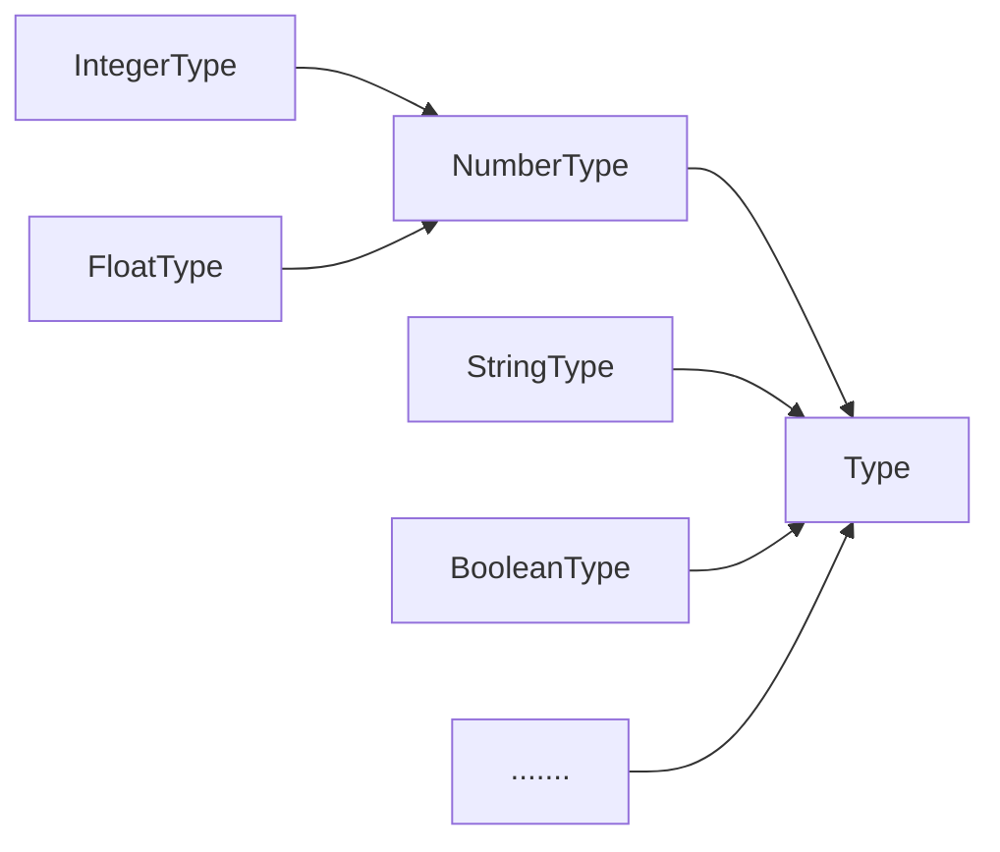

# CustomFactory [](http://travis-ci.org/snowyu/custom-factory.js) [](https://npmjs.org/package/custom-factory) [](https://npmjs.org/package/custom-factory) [](https://npmjs.org/package/custom-factory)


Easily add the factory ability to your class or object which can be singleton, name, register/unregister and aliases your class/object items.

The factory could be hierarchical or flat. defaults to hierarchical.
The flat factory means register only on the Root Factory.

The General Factory for class or object(singleton instance).

Hierarchical factory:

1. all registered items are stored into the root factory and parent factory.
1. the registered items are the enumerable properties of the root factory class and parent factory class.
   * unless registered names or aliases exists.

## Usage

* BaseFactory: the flat factory
  * CustomFactory: the hierarchical factory

### Factory Usage

The Simplest Class Factory.

```js
const IntegerType = TypeFactory.get('Integer')
// it can use an alias to visit.
const IntType = TypeFactory.get('Int')

// Int1Type is the same with IntType
IntType.should.be.equal(IntegerType)

var i = new IntType(1)
```

The hierarchical singleton object factory.

```js
const TextCodec = Codec.get('Text')     // # get the JsonCodec Class
const JsonCodec = Codec.get('Json')     // # note: name is case-sensitive!
const Json1Codec = TextCodec.get('Json') // # or like this

const TextCodec = Codec.get('Text')  // or Codec('utf8')

JsonCodec.should.be.equal(Json1Codec)

const NumberType   = Type.get('number')
const IntegerType  = Type.get('integer')

isInheritedFrom(IntegerType, NumberType).should.be.true
IntegerType.should.be.equal(NumberType.get('integer'))

const aInteger = new IntegerType(124)
const aRangeInteger = new IntegerType(0, {min: 0, max: 100})

expect(aInteger).toBeGreaterThan(aRangeInteger)
aRangeInteger.assign(6)
expect(aInteger + aRangeInteger).toEqual(130)

```

## Factory Development

Abstract Codec hierarchical factory.



The realistic example

```js
import { CustomFactory } from 'custom-factory'

export class Type extends CustomFactory {

  static findRootFactory() {
    return this._findRootFactory(Type)
  }

  static toValue(aValue, options) {return aValue}
  static validate(aValue, raiseError, aOptions) {}
  static createType(options) {
    const vTypeClass = createCtor(options.name)
    if (register(vTypeClass, this, options)) {
      // assign type properties from options
      assignProperties(vTypeClass, options)
      return vTypeClass
    }
  }

  initialize(value, options) {
    this.assign(value, options)
  }

  assign(value, options) {this.value = this.constructor.toValue(value, options)}
  isValid(options) {return this.constructor.validate(this.value, false, options) }
  valueOf() {return this.value}
  toJSON() {return this.toObject()}

  toString() {return this.value+''}
  toObject(options) {return this.value}
}

export const register = Type.register.bind(Type)
export const unregister = Type.unregister.bind(Type)
export const alias = Type.setAliases.bind(Type)

export class IntegerType extends Type {
  static toValue(aValue, options) {
    let result
    const vTypeOf = typeof aValue
    if (vTypeOf === 'string') {
      result = parseInt(aValue)
    } else if (vTypeOf === 'number') {
      result = Math.round(aValue)
    }
    return result
  }
}
register(IntegerType)
aliases(IntegerType, 'int')

```

## API

The registered class is put into the property(the specified registered name) of the parent class.

* BaseFactory: the flat factory
  * static members:
    * `register(ctor, options)`: register a class to the factory,
      * ctor: it will be automatically inherited to the Factory after registered if ctor isn't derived from BaseFactory
      * options*(object|string)*: the options for the class and the factory
        * it is the registered name if aOptions is string.
        * name*(String)*: optional unique id name to register, defaults to class name
        * displayName: optional display name
        * baseNameOnly*(number)*: extract basename from class name to register it if no specified name.
          defaults to 1. the baseNameOnly number can be used on hierarchical factory, means max level to extract basename.
          0 means use the whole class name to register it, no extract.
          * eg, the `Codec` is a Root Factory, we add the `TextCodec` to "Codec", add the `JsonTextCodec` to "TextCodec"
            * baseNameOnly = 1: `TextCodec` name is 'Text', `JsonTextCodec` name is 'JsonText'
            * baseNameOnly = 2: `TextCodec` name is 'Text', `JsonTextCodec` name is 'Json'
    * `unregister(aName|aClass|undefined)`: unregister the class, class name or itself from the Factory
    * `setAliases(aClass, ...aliases: string[])`: add/update aliases to the aClass.
    * `setAlias(aClass, alias: string)`: add/update an alias to the aClass.
    * `getAliases(aClass: typeof BaseFactory|string|undefined)`: get the aliases of the class or itself
    * `removeAlias(...aliases: string[])`: remove aliases from the factory.
    * `cleanAliases(aClass: typeof BaseFactory|string|undefined)`: remove all aliases of the registered item or itself
    * `aliases: string[]`: get or set the aliases of itself.
      * Note: assign the value will clean all aliases of itself first.
    * `getDisplayName(aClass: typeof BaseFactory|string|undefined)`: get the display of the class or itself
    * `setDisplayName(aClass?: typeof BaseFactory|string|undefined, displayName: string|{displayName: string})`: set the display of the class or itself
    * `forEach(cb: (class: typeof BaseFactory, name: string)=>'brk'|string|undefined)`: executes a provided callback function once for each registered element.
    * `get(name: string): typeof BaseFactory`: get the registered class via name
    * `registeredClass(aName: string|undefined): false|typeof BaseFactory`: check the name, alias or itself whether registered
    * `formatName(aName: string): string`: format the registered name, defaults to same as aName. you can override this method to implement case insensitive.
    * `findRootFactory(): typeof BaseFactory`: must override, to tell which Factory Class is the Root.
    * `_Factory`: internal property, The Root Factory class
    * `_children`: internal property, The registered Factory classes
    * `_aliases`: internal property, The registered Factory aliases
  * instance members
    * `initialize()`: initialize instance method which called by `constructor()`
      * pass through all arguments coming from constructor
    * `toString(): string`: return the `this.name`.
* CustomFactory: the hierarchical factory inherits from BaseFactory(Only the different and new methods are listed here)
  * static members
    * `register(aClass, aParentClass, aOptions)`: register the aClass to aParentClass Class.
    * `register(aClass, aOptions)`: register the aClass to itself or `aOptions.parent`
      * `options`*(object|string)*: the options for the class and the factory
        * it is the registered name if aOptions is string.
        * `name`*(String)*: optional unique id name to register, defaults to class name
        * `displayName`: optional display name
        * `baseNameOnly`*(number)*: extract basename from class name to register it if no specified name.
          defaults to 1. the baseNameOnly number can be used on hierarchical factory, means max level to extract basename.
          0 means use the whole class name to register it, no extract.
          * eg, the `Codec` is a Root Factory, we add the `TextCodec` to "Codec", add the `JsonTextCodec` to "TextCodec"
            * baseNameOnly = 1: `TextCodec` name is 'Text', `JsonTextCodec` name is 'JsonText'
            * baseNameOnly = 2: `TextCodec` name is 'Text', `JsonTextCodec` name is 'Json'
    * `path(aClass?: typeof CustomFactory, aRootName?: string)`: get the path string of this aClass factory item or itself.
      * `aRootName`: defaults to `RootFactory.ROOT_NAME || RootFactory.prototype.name || RootFactory.name`
    * `pathArray(aClass?: typeof CustomFactory, aRootName?: string)`: get the path array of this aClass factory item or itself.
      * `aRootName`: defaults to `RootFactory.ROOT_NAME || RootFactory.prototype.name || RootFactory.name`

**Note**: the `name` is **case sensitive**.

## Changes

### v2.x

* refract the code with class.

### v.1.5

+ *broken* (1.5)rename Factory::get() instance method to Factory::getFactoryItem()

### v1.4

+ add baseNameOnly option to extract basename from class name when register it.
* *broken* `Factory._objects`: mark deprecated. use the `Factory::_objects` instead
* *broken* `Factory._aliases`: mark deprecated. use the `Factory::_aliases` instead
+ (1.4.4)It will be treated as customized path name if the registered name is beginning with path delimiter('/')
  * affects to path() and pathArray()
* (1.4.5)all added properties of the factory class are non-enumerable now.
+ (1.4.5)add forEach()/forEachClass() to iterate the registered items.
  * break if callback function return 'brk'
+ (1.4.6)add Factory::get() instance method to get registered items.
* (1.4.10) aliases() can get the aliases of a class itself.
+ (1.4.11) add the displayName() function to get or set display name.
